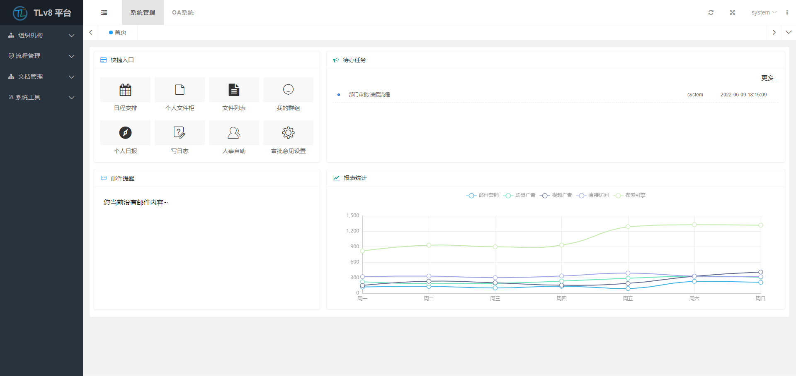
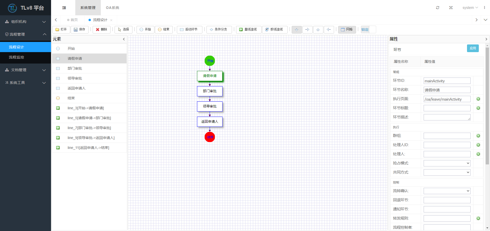
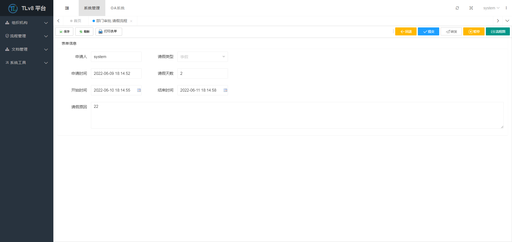

# TLv8 平台-Flask版

#### 介绍
基于Flask（Flask是一个用Python编写的Web应用程序框架）开发的Web应用系统框架，项目集成了工作流引擎，内置了组织机构权限管理等功能，可以应用于OA、HR、CRM、PM等系统开发。

#### 软件架构

- Flask：轻量级的用Python编写的Web应用程序框架；
- Mysql：数据库
- layui：开源免费的前端 特别感谢：[layui mini](https://gitee.com/zhongshaofa/layuimini)


#### 安装教程

1.  为开发环境安装virtualenv
virtualenv是一个虚拟的Python环境构建器。它可以帮助用户并行创建多个Python环境。 因此，它可以避免不同版本的库之间的兼容性问题。

以下命令用于安装virtualenv：

```
pip install virtualenv
```

此命令需要管理员权限。您可以在Linux / Mac OS上的 pip 之前添加 sudo 。

如果您使用的是Windows，请以管理员身份登录。在Ubuntu上， virtualenv可以使用它的包管理器安装。

```
sudo apt-get install virtualenv
```


2.  创建virtualenv虚拟环境：进入项目文件夹，执行下面的命令：

```
virtualenv venv
```


3.  启动venv虚拟环境

Windows环境：

```
venv\Scripts\activate
```
Linux环境：

```
source venv/bin/activate
```

4.  使用如下命令安装Flask依赖包:

```
pip install -r requirements.txt
```

5.  创建数据库并且确认config.py文件中数据库配置部分无误，

数据库：tlv8(可以自定义需要注意config.py中的配置)

- 字符集：utf8mb4
- 排序规则：utf8mb4_unicode_ci


然后使用migrate创建数据表，命令如下：

```
python  manage.py  db  init        # 创建迁移仓库,首次使用  
python  manage.py  db  migrate     # 创建迁移脚本
python  manage.py  db  upgrade     # 把迁移应用到数据库中
```

6.  初始化基础数据：

导入sql目录下的: tlv8.sql


#### 使用说明

1.  启动测试服务：

```
python  manage.py runserver
```


2.  浏览器访问：

```
http://127.0.0.1:5000/
```


3.  登录系统：

默认用户：system/1


#### 在线演示
http://flask.tlv8.com/


#### 效果展示

-系统首页



-组织权限


-流程设计



-功能页面



